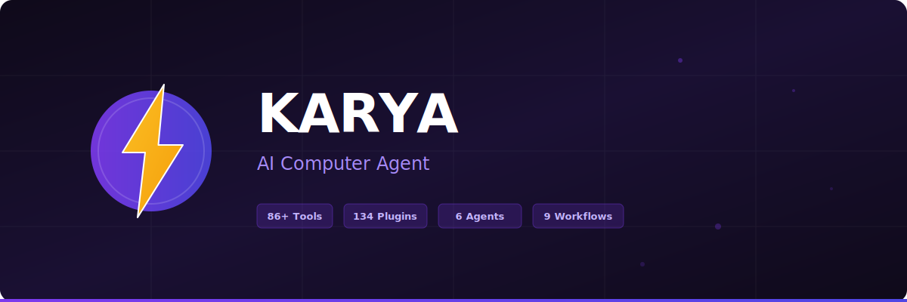

<p align="center">
  
</p>

<h1 align="center">⚡ Karya</h1>
<h3 align="center">AI Computer Agent that actually DOES things.</h3>

<p align="center">
  
  
  
  
  
  
  
</p>

<p align="center">
  Karya doesn't just chat — it <b>browses the web, writes code, manages files, runs commands, searches the internet, and automates tasks</b> on your computer. Built with <a href="https://mastra.ai">Mastra</a> + Next.js + TypeScript.
</p>

---

## ✨ Features

### 🤖 6 Specialist Agents
| Agent | Specialty |
|-------|----------|
| **Supervisor** | Orchestrates all agents, routes tasks |
| **Browser** | Navigates websites, fills forms, extracts data |
| **Coder** | Writes code, runs scripts, manages git |
| **File Manager** | Reads, writes, organizes files |
| **Researcher** | Web search, information synthesis |
| **Data Analyst** | CSV/JSON parsing, API calls, data transforms |

### 🔧 86+ Tools across 21 Categories
`Browser` `Files` `Shell` `System` `Code` `Data` `Memory` `Git` `Scheduler` `Triggers` `Plugins` `Workflows` `Skills` `Web` `Network` `Documents` `Images` `Planning` `Recovery` `Agents` `Confidence`

### 🔌 134 Plugins
Pre-loaded skills for: GitHub, LinkedIn, Discord, Slack, Telegram, YouTube, Notion, Docker, MongoDB, Redis, Stripe, Firebase, Trello, Obsidian, and 120+ more.

### 📡 5 Transport Channels
- **Web UI** — Streaming chat with tool chips, voice, dark mode
- **REST API v1** — 31 versioned endpoints with auth + rate limiting
- **WebSocket** — Real-time bidirectional on port 3002
- **CLI REPL** — 20 commands + interactive mode
- **Telegram** — Full bot with photo/vision support

### 🛡️ 4-Layer Security Pipeline
1. **InputNormalizer** — Strips unicode tricks
2. **SecurityFilter** — Blocks prompt injection (9 patterns)
3. **TokenLimiter** — 16K context cap
4. **StepControl** — Disables tools after 8 steps

Plus: Command guard (20+ blocked patterns), path guard, rate limiter, audit logging, `requireApproval` on dangerous tools.

### 🧠 Mastra Memory System
- **Message History** — Last 20 messages
- **Working Memory** — Persistent user profile (name, preferences, goals)
- **Semantic Recall** — RAG search past messages (with API key)
- **Observational Memory** — Background compression (with API key)

### ⚙️ 9 Workflows (All Mastra Patterns)
`.then()` `.branch()` `.parallel()` `.foreach()` `.dountil()` `suspend/resume`

### 🎤 Voice
Browser-native TTS (read responses aloud) + STT (speak to input). No API key needed.

---

## 🚀 Quick Start

```bash
# Clone
git clone https://github.com/kulharir7/karya.git
cd karya

# Install
npm install

# Configure (.env)
cp .env.example .env
# Edit .env with your LLM provider details

# Start
npm run dev
```

Open **http://localhost:3000** 🎉

---

## ⚙️ Configuration

### LLM Providers
Edit `.env`:
```bash
# Ollama Cloud (recommended)
LLM_PROVIDER=ollama-cloud
LLM_BASE_URL=https://ollama.com/v1
LLM_MODEL=qwen3-coder:480b
LLM_API_KEY=your_key

# Or use any provider:
# anthropic, openai, google, openrouter, ollama, custom
```

Available models: `qwen3-coder:480b`, `gpt-oss:120b`, `gemini-2.5-flash:free`, `kimi-k2.5:cloud`, `deepseek-r1:cloud`, `minimax-2.7`

### Settings UI
Change model, security, plugins, MCP — all from the browser:

**Settings → [🤖 Model] [🔒 Security] [🔌 Plugins] [🔗 MCP] [ℹ️ About]**

Model changes take effect **instantly** — no restart needed.

---

## 🏗️ Architecture

```
User Message
     │
┌────┼────┐────────┐──────────┐
│    │    │        │          │
Web  CLI  WS    Telegram   REST API
│    │    │        │          │
└────┴────┴────────┴──────────┘
              │
       ChatProcessor (HEART)
        ├── Plugin skills injected
        ├── Lessons injected (self-improving)
        ├── Context compaction
        │
   agent.stream() → Mastra Supervisor
        ├── 86+ tools (security-checked)
        ├── 6 specialist agents
        ├── 9 workflows
        │
   Post-task:
        ├── Audit logged (SQLite)
        ├── Self-review (async)
        └── Memory persisted
```

---

## 📚 API

### REST API v1 (31 routes)
```
POST /api/v1/chat              — Chat (SSE streaming)
GET  /api/v1/sessions          — List sessions
GET  /api/v1/tools             — List 86+ tools
GET  /api/v1/agents            — List 6 agents
GET  /api/v1/status            — System dashboard
GET  /api/v1/security          — Security config + blocked log
GET  /api/v1/plugins           — 134 plugins
GET  /api/v1/heartbeat         — Proactive tasks
GET  /api/v1/triggers          — Automation triggers
GET  /api/v1/self-improve      — Quality stats
POST /api/v1/auth/tokens       — API token management
POST /api/v1/model             — Switch model (instant)
...and 19 more
```

### WebSocket (port 3002)
```json
{ "type": "subscribe", "sessionId": "xxx" }
{ "type": "chat", "data": { "message": "hello" } }
{ "type": "abort" }
```

---

## 🔌 Plugins

134 pre-loaded plugins. Create your own:

```
workspace/plugins/my-plugin/
├── plugin.json    — Manifest
└── SKILL.md       — Agent instructions
```

Agent auto-discovers plugins via trigger matching.

---

## 🛠️ Tech Stack

- **Framework**: [Mastra](https://mastra.ai) v1.16.0
- **Frontend**: Next.js 16 + React 18 + TypeScript
- **Database**: LibSQL (SQLite)
- **Streaming**: SSE + WebSocket
- **Bot**: grammy (Telegram)
- **Browser**: Stagehand v3
- **Voice**: Web Speech API

---

## 📄 License

MIT — do whatever you want with it.

---

<p align="center">
  Built with ⚡ by <a href="https://github.com/kulharir7">Ravi Kulhari</a>
</p>
